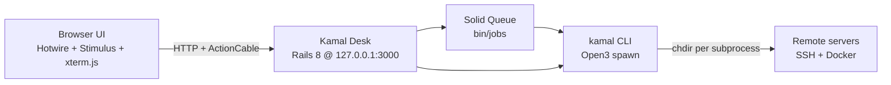
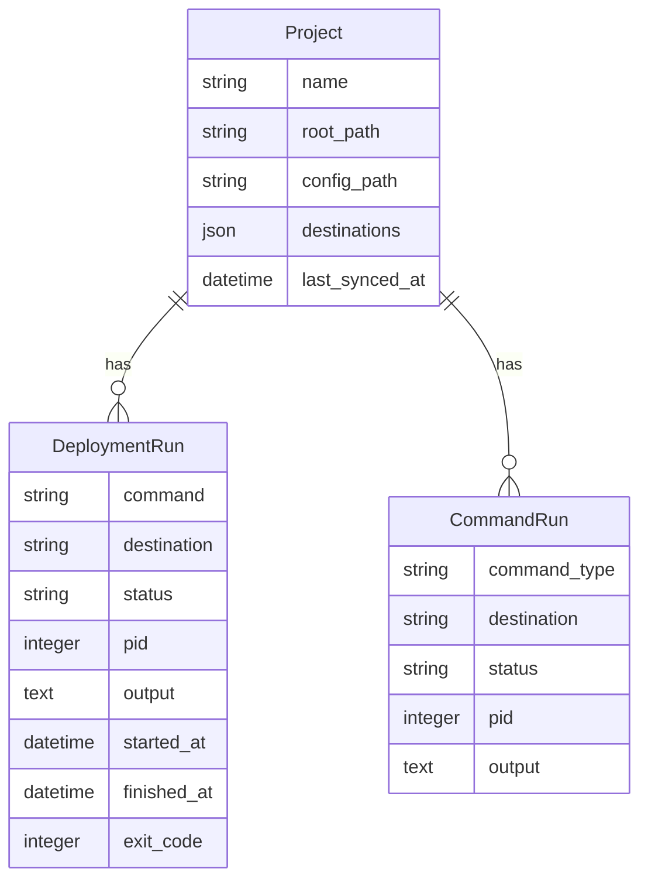

# Kamal Desk — Plan & Implementation Record

**Status:** Executed (July 2026)  
**Name:** Kamal Desk  
**Local path:** `~/Sites/kamal-desk`  
**GitHub:** https://github.com/BasharLulu/kamal-desk  
**Tagline:** The missing web UI for Kamal deployments.

## Product decisions (locked in)

| Decision | Choice |
|----------|--------|
| Platform | Rails 8 web app, localhost-only |
| Ruby | 4.0.5 (`.ruby-version`, `.tool-versions`) |
| Database | SQLite (`storage/development.sqlite3`) |
| Location | `~/Sites/kamal-desk` (not `~/Projects`) |
| Audience | Personal/internal tool |
| Monetization | None (no licensing) |
| Multi-project | Yes — register many Kamal apps |
| Project registration | Auto-discover from `~/Sites` + manual path input (no native folder picker — unreliable in browsers) |

## What Polaris does (feature target)

[Polaris](https://polaris-deploy.com/) is a native macOS app that wraps the **Kamal CLI**. Kamal Desk replicates the operational workflow in a browser.

| Area | Capability | Kamal commands |
|------|------------|----------------|
| Projects | Register apps, list destinations | Parse `deploy.yml` + `deploy.<dest>.yml` |
| Deploy | Deploy/redeploy with live output | `kamal deploy`, `kamal redeploy`, `kamal setup` |
| Rollback | Pick version, roll back | `kamal app containers -q`, `kamal rollback VERSION` |
| Console | Remote Rails console | `kamal app exec -i --reuse "bin/rails console"` |
| Proxy | Routes, hosts, TLS | `kamal proxy details`, `kamal server exec … kamal-proxy list` |
| Logs | Follow container logs | `kamal app logs -f` |
| State | Containers, server load, audit | `kamal details`, `kamal app containers`, `kamal audit`, `docker stats` |

## Architecture



**Local-first:** Kamal Desk reads local `deploy.yml` files and invokes `kamal` with the user's SSH agent/keys. Not designed as a hosted SaaS.

**Critical implementation rule:** Never use `Dir.chdir` in the Puma process. Use `Open3.popen2e(..., chdir: project.root_path)` so concurrent requests don't inherit another project's working directory (see Post-ship fixes).

## Stack (as built)

| Layer | Choice |
|-------|--------|
| Framework | Rails 8.1 on Ruby 4.0.5 |
| UI | Hotwire, Tailwind CSS |
| Streaming | ActionCable (`async` adapter in dev) |
| Jobs | Solid Queue (`bin/jobs` required) |
| DB | SQLite + Solid Cache/Cable/Queue schemas |
| Config parsing | `kamal` gem — `Kamal::Configuration.create_from` |
| Console | xterm.js (vendor) + PTY + `ConsoleChannel` |
| Process execution | `Open3.popen2e` with `chdir:` option |

## Data model (implemented)



- **Project** — registered path under `~/Sites` or `~/Developer`; must contain `config/deploy.yml` or `deploy.yml`.
- **DeploymentRun** — deploy / redeploy / setup / rollback history with streamed output.
- **CommandRun** — logs streaming and console sessions (also used for accessory commands).

## App structure (as built)

```
app/
  models/
    project.rb
    deployment_run.rb
    command_run.rb
  services/kamal/
    config_loader.rb
    destination_discovery.rb
    project_discovery.rb      # scan ~/Sites for deploy.yml
    command_runner.rb         # Open3 + chdir: (NOT Dir.chdir)
    lock_inspector.rb
    proxy_inspector.rb
    container_inspector.rb
    audit_reader.rb           # cached kamal audit
    server_metrics.rb         # cached docker stats
    log_streamer.rb
    console_session.rb        # PTY + registry
    secret_filter.rb
  channels/
    command_output_channel.rb
    log_stream_channel.rb
    console_channel.rb
  controllers/
    projects_controller.rb
    deployments_controller.rb
    deployment_runs_controller.rb  # show + cancel
    containers_controller.rb
    proxy_controller.rb
    audits_controller.rb
    server_metrics_controller.rb # show + refresh (polling)
    logs_controller.rb
    consoles_controller.rb
    maintenance_controller.rb
    accessories_controller.rb
  jobs/
    deployment_job.rb
    log_stream_job.rb
    console_session_job.rb
    accessory_command_job.rb
  javascript/controllers/
    command_output_controller.js
    log_stream_controller.js
    terminal_controller.js
    poll_refresh_controller.js
```

## Implementation by phase

### Phase 1 — Project workspace ✅

**Commit:** `519286b`

- Rails 8 scaffold at `~/Sites/kamal-desk`
- Register projects by path; auto-detect `config/deploy.yml`
- `Kamal::DestinationDiscovery` + `Kamal::ProjectDiscovery` (scan `~/Sites`, depth 2)
- Discovered projects list with one-click Add on index page
- Config summary panel per destination (service, image, hosts, proxy, accessories, aliases)
- `kamal version` health check

### Phase 2 — Deployments and rollback ✅

**Commits:** `954c34a` (MVP), `df11581`

- Deploy / redeploy / setup with destination selector
- Live output via `CommandOutputChannel` + `DeploymentJob`
- Cancel deploy (SIGINT via stored `pid`)
- Rollback from Containers view (version buttons)
- Deploy lock awareness (`kamal lock status`) — blocks deploy if locked
- Operations layout: config + history left, operations + live output right
- One concurrent deploy per project (DB check)
- `Shellwords.split` for command parsing

### Phase 3 — Production state dashboard ✅

**Commit:** `45fa32a`

- Containers: `app containers`, `app details`, `kamal details`
- Proxy: parsed `kamal-proxy list` table + raw `proxy details`
- Audit: full page + recent preview on overview (cached, redacted)
- Server metrics: `docker stats` with 15s auto-refresh + Rails.cache (15s TTL)

### Phase 4 — Logs and remote Rails console ✅

**Commit:** `060a0f6`

- `CommandRun` model for long-running non-deploy commands
- Logs: `kamal app logs -f` via `LogStreamJob` + `LogStreamChannel`, pause/resume scroll
- Console: PTY session via `ConsoleSession` + `ConsoleChannel` + xterm.js
- Production warning banner on console page
- TTY resize support via ActionCable `receive`

### Phase 5 — Polish and hardening ✅

**Commits:** `a42837c`, `ea16f70`

- Multi-project sidebar in layout
- Accessories page: boot + logs per accessory from config
- Maintenance / live mode buttons on overview
- Optional HTTP basic auth: `KAMAL_DESK_PASSWORD` (+ `KAMAL_DESK_USERNAME`, default `admin`)
- `Kamal::SecretFilter` redacts audit output lines matching password/secret/token/key
- Path allowlist: `~/Sites`, `~/Developer`

## Post-ship bug fixes

| Commit | Issue | Fix |
|--------|-------|-----|
| (uncommitted → included in `6128252`) | `NameError: on_start` | Use `@on_start`, `@on_output`, `@should_stop` instance variables in `CommandRunner#run` |
| `6128252` | `PendingMigrationError` with halaplan's 68 migrations when clicking Overview | **Root cause:** `Dir.chdir` in `CommandRunner` changed cwd for entire Puma process; concurrent requests resolved `db/migrate` relative to registered project (e.g. halaplan). **Fix:** `Open3.popen2e(*cmd, chdir: project.root_path)` — only child process changes directory. |

## Setup & operations

### First-time setup

```bash
cd ~/Sites/kamal-desk
bin/setup   # bundle, db:prepare, loads queue + cable schemas
```

`bin/setup` also runs:

```ruby
load db/queue_schema.rb
load db/cable_schema.rb
```

Required because Solid Queue tables are not in standard `db/migrate` for development.

### Daily dev (3 terminals)

```bash
# Terminal 1
bin/rails server -b 127.0.0.1

# Terminal 2
bin/jobs

# Terminal 3 (if CSS looks unstyled)
bin/rails tailwindcss:watch
```

`bin/dev` (foreman) may fail if asdf Ruby 4.0.5 isn't active in shell — use separate terminals instead.

### Optional LAN auth

```bash
KAMAL_DESK_PASSWORD=secret bin/rails server -b 127.0.0.1
```

### Registering projects

1. Open http://127.0.0.1:3000
2. Pick from **Discovered in ~/Sites** or enter path manually
3. Select destination (e.g. `cloudflare`, `staging`) per project

## Git history (reference)

| Commit | Description |
|--------|-------------|
| `954c34a` | Initial MVP — project workspace, deploy ops, state views |
| `519286b` | Phase 1 — auto-discover from ~/Sites |
| `df11581` | Phase 2 — cancel, lock, operations layout |
| `45fa32a` | Phase 3 — details, audit preview, metrics polling |
| `060a0f6` | Phase 4 — logs + remote console |
| `a42837c` | Phase 5 — sidebar, accessories, maintenance, auth, redaction |
| `ea16f70` | Fix accessories view + maintenance buttons |
| `6128252` | Fix concurrent `Dir.chdir` migration race |

## Security guardrails (implemented)

- Bind to `127.0.0.1` in `Procfile.dev`
- Never render `kamal config` or `.kamal/secrets` raw
- `Project::ALLOWED_ROOTS` — `~/Sites`, `~/Developer`
- Args passed as arrays to `Open3` (not shell-interpolated)
- Deploy mutex per project
- Optional HTTP basic auth via env
- Audit output passed through `SecretFilter`

## Deferred / future work

| Item | Priority | Notes |
|------|----------|-------|
| Proxy request traffic metrics | Low | Polaris feature; needs research into `kamal-proxy` metrics or log parsing |
| `bin/dev` + foreman + asdf | Low | Document or fix foreman Ruby version detection |
| Accessory log live streaming | Low | Currently one-shot `AccessoryCommandJob`, not streamed UI |
| Remote console hardening | Medium | Resize edge cases, disconnect cleanup, error states |
| Auto-discover `~/Developer` | Low | Only `~/Sites` scanned today (both allowed for manual paths) |
| Keyboard shortcuts | Low | Phase 5 polish |
| Test suite | Medium | No automated tests yet |
| Deploy Kamal Desk via Kamal | Optional | `config/deploy.yml` exists from `rails new` |

## Differences from Polaris

| Polaris | Kamal Desk |
|---------|------------|
| Native macOS app | Browser on localhost |
| Paid license (2 devices) | Free, personal |
| Native folder picker | Auto-discover + path input |
| Polished native UX | Functional Hotwire + Tailwind |
| Proxy traffic dashboard | Not implemented |

## Verification checklist

Use a real Kamal project (e.g. halaplan):

- [ ] Register project → destinations and hosts render
- [ ] `kamal deploy` streams output; `DeploymentRun` records result
- [ ] Cancel mid-deploy works
- [ ] Rollback from Containers view works
- [ ] Proxy list matches server `kamal-proxy list`
- [ ] Server metrics auto-refresh
- [ ] Logs stream with pause/resume
- [ ] Remote Rails console accepts input
- [ ] Navigate between tabs while another project's kamal command runs — no migration errors (post-`6128252`)

## Prerequisites

- Ruby 4.0.5
- Rails 8.1
- `kamal` gem (in Gemfile)
- Docker + SSH access to Kamal-managed servers
- Kamal projects under `~/Sites` with `config/deploy.yml`
